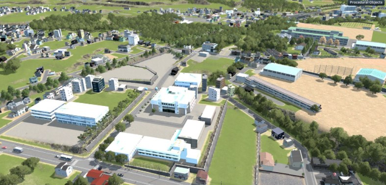

# Cities: Skylines PLATEAU Mod
 

### 1.概要
PLATEAUの3D都市モデルを都市育成シミュレーションゲーム"Cities:Skylines"にインポートするMOD（SkylinesPLATEAU）です。

オープンデータである3D都市モデルをゲーム内に取込み、実際の都市を再現することでビジュアライゼーションツールやまちづくりシミュレーターとして、まちづくりの計画検討やワークショップ、教育の現場等で活用することができます。
