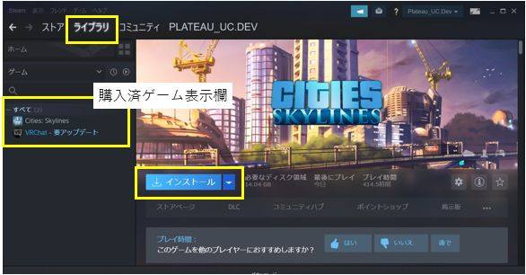
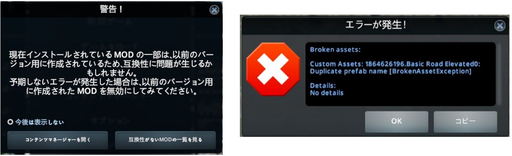

## 1. Cities Skylinesのインストール

------

### 1.1 PCの準備

推奨スペックの条件を満たすPC、環境を準備する。

SkylinesPLATEAUを使用したゲーム環境の推奨スペック（動作確認環境）は以下のとおり。

- Windows10　64ビット版
- CPU intel Core i7-9700以上　 メモリー　32GB以上
- インターネット接続環境
- Steamアプリがオンラインモード

<!-- Steamアプリ画面 -->

 
 

### 1.2 Steamアカウントの作成とSteamアプリのインストール

初めてSteamを利用する場合はアカウント作成とログインを行い、Steamアプリをインストールする。

① Steamウェブサイトでアカウントを作成し、ログインする。
https://store.steampowered.com/join/
<!--
 
アカウント作成画面  -->

 
 

② Steamアプリをインストールする。
https://store.steampowered.com/about/

### 1.3 Cities: Skylinesの購入とインストール

初めてCities: Skylinesを利用する場合はPC版Cities: Skylinesの購入とインストールを行う。

① Steamウェブサイト＞ストアからCities: Skylinesを購入する。
　　https://store.steampowered.com/app/255710/Cities_Skylines/
<!--
Steamウェブサイト、購入画面  -->

 
 

② Steamアプリ＞ライブラリ画面左欄の「Cities: Skylines」をクリック。

③ 「インストール」ボタンをクリックしてインストールを実行する。（インストール時の設定は特に理由がない場合は初期値のままとする）

<!--
Steamアプリ（ライブラリ）画面、インストールボタン   -->

 

### 1.4 注意点

- 3D都市モデルの整備時期、整備内容により、インポート時の精度が低下する可能性があります。

- アプリアップデートにより、マップエディタやゲームを開く際にMOD、アセットに関するエラーが表示されることがありますが、通常は「OK」ボタンで操作を実行してください。ゲームの動作に支障をきたす場合は、表示された内容を確認しMOD、アセットのサブスクライブ解除等の措置を実施してください。

- 既存MODの設定の上書き操作が含まれます。必要に応じて事前にバックアップを行ってください。

- Cities: Skylinesのインストール時、初回起動はローカルファイル生成のため、時間がかかることがあります。

- 企業や学校等のプロキシ環境でログイン、アプリの更新が行えない場合はネットワーク管理者の方にご相談ください。

<!--
エラー表示例   -->

 
 
