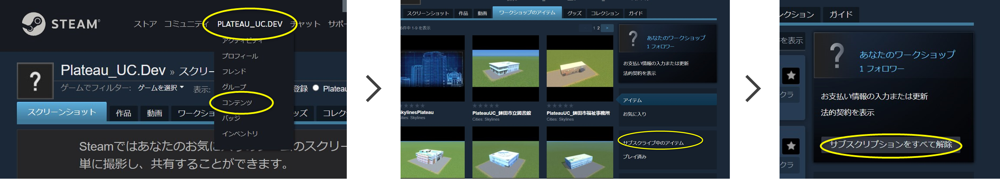

## 2.  SkylinesPLATEAUの導入

------

### 2.1 SkylinesPLATEAU及び、必須MOD・アセットの導入

SkylinesPLATEAU及び、必須MOD・アセットを導入するため、Steamのサイトからサブスクライブする。

Cities: SkylinesではMODによるUIの日本語化と高速道路（対向2車線）のアセットが必要となる。

① Cities: Skylines>SkylinesPLATEAU（[ Steam](https://steamcommunity.com/sharedfiles/filedetails/?id=3108309824)[ワークショップ](https://steamcommunity.com/sharedfiles/filedetails/?id=3108309824)[::](https://steamcommunity.com/sharedfiles/filedetails/?id=3108309824)[SkylinesPLATEAU](https://steamcommunity.com/sharedfiles/filedetails/?id=3108309824)[検証用 ](https://steamcommunity.com/sharedfiles/filedetails/?id=3108309824)[(steamcommunity.com) ](https://steamcommunity.com/sharedfiles/filedetails/?id=3108309824)）（※URLは今後変更予定）　をブラウザで開く。

② 「+全てをサブスクライブ」ボタンをクリック。

 

 
 

### (参考)　サブスクリプションの解除

既にサブスクライブ済のMOD同士の干渉回避が必要な場合やコレクション「SkylinesPLATEAU_必須MOD、アセット」を更新する必要がある場合には、サブスクリプションをすべて解除後、必要なMOD、アセットのサブスクライブを行う。

① Steamサイト、Steamアプリ上部のユーザー名をクリックし、その後表示される「コンテンツ」をクリック。

② ワークショップタブから右下の「サブスクライブ中のアイテム」をクリック。

③ 「サブスクリプションをすべて解除」をクリック。

 

 
 

