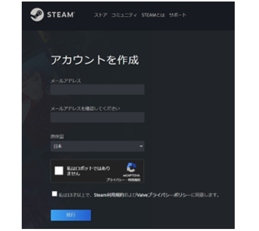
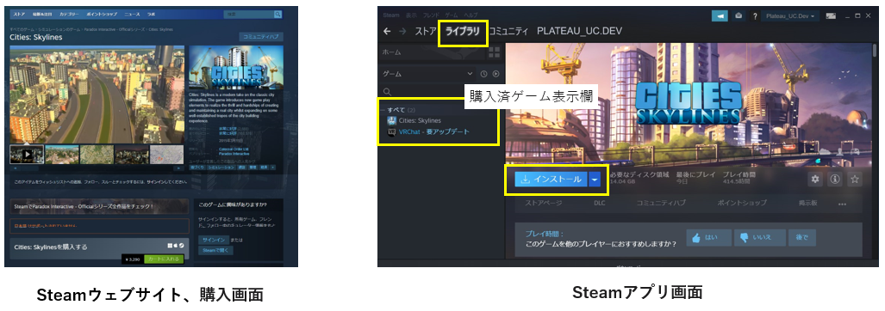
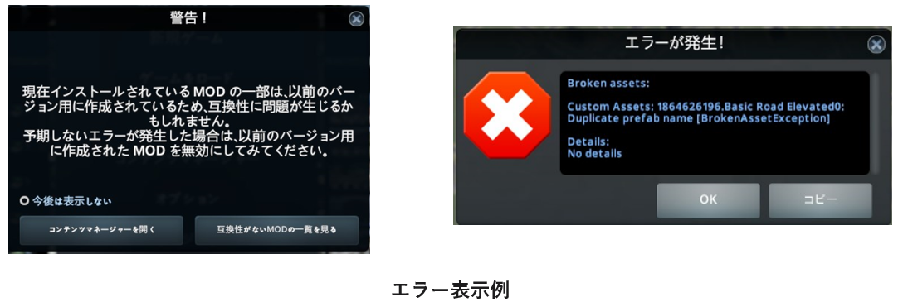
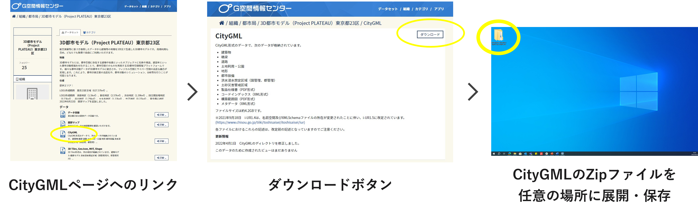
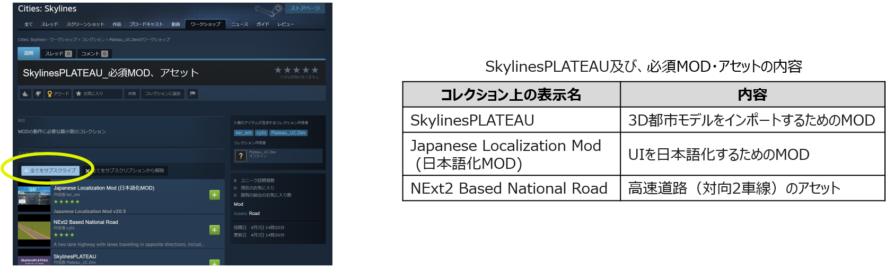
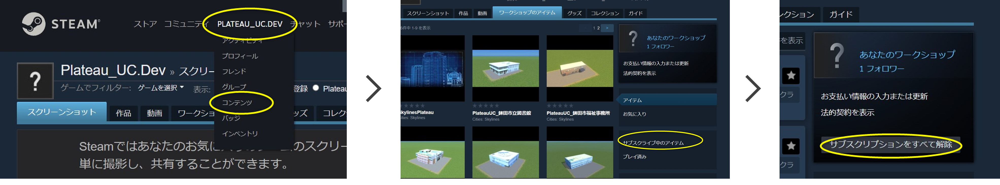

# Cities: Skylines起動前の準備作業

------

## 1. 機材等の準備、注意点

### 1.1 PCの準備

推奨スペックの条件を満たすPC、環境を準備する。

SkylinesPLATEAUを使用したゲーム環境の推奨スペック（動作確認環境）は以下のとおり。

- Windows10　64ビット版
- CPU intel Core i7-9700以上　 メモリー　32GB以上
- インターネット接続環境
- Steamアプリがオンラインモード

 
 

### 1.2 Steamアカウントの作成とSteamアプリのインストール

初めてSteamを利用する場合はアカウント作成とログインを行い、Steamアプリをインストールする。

① Steamウェブサイトでアカウントを作成し、ログインする。
https://store.steampowered.com/join/

② Steamアプリをインストールする。
https://store.steampowered.com/about/

 
 

### 1.3 Cities: Skylinesの購入とインストール

初めてCities: Skylinesを利用する場合はPC版Cities: Skylinesの購入とインストールを行う。 

① Steamウェブサイト＞ストアからCities: Skylinesを購入する。
　　https://store.steampowered.com/app/255710/Cities_Skylines/

② Steamアプリ＞ライブラリ画面左欄の「Cities: Skylines」をクリック。

③ 「インストール」ボタンをクリックしてインストールを実行する。（インストール時の設定は特に理由がない場合は初期値のままとする）

 
 

### 1.4 注意点

- 3D都市モデルの整備時期、整備内容により、インポート時の精度が低下する可能性があります。

- アプリアップデートにより、マップエディタやゲームを開く際にMOD、アセットに関するエラーが表示されることがありますが、通常は「OK」ボタンで操作を実行してください。ゲームの動作に支障をきたす場合は、表示された内容を確認しMOD、アセットのサブスクライブ解除等の措置を実施してください。

- 既存MODの設定の上書き操作が含まれます。必要に応じて事前にバックアップを行ってください。

- Cities: Skylinesのインストール時、初回起動はローカルファイル生成のため、時間がかかることがあります。

- 企業や学校等のプロキシ環境でログイン、アプリの更新が行えない場合はネットワーク管理者の方にご相談ください。

  

 
 

------

## 2.  事前準備

### 2.1 3D都市モデルのダウンロード

ゲーム上に再現したい都市の3D都市モデルをダウンロード（※1）し、任意（デスクトップ等）の場所に保存する。 

① G空間情報センター3D都市モデル（Project PLATEAU）ポータルサイト（https://www.geospatial.jp/ckan/dataset/plateau）をブラウザで開く。

② リンクから任意の都市のデータセットページに進み、データ欄の「CityGML」をクリック。

③ CityGMLのページで「ダウンロード」ボタンをクリックし、ファイルをダウンロード、Zipファイルを展開する（保存場所はどこでもよい）。

※1　サンプルデータ（茨城県鉾田市の3D都市モデルの一部データ）を使用する場合は
 https://github.com/Project-PLATEAU/UC22-010-SkylinesPLATEAU/blob/main/SampleData/08234_hokota-shi_2020_citygml_4_op_sample_area.zip をダウンロードする。

 
 

### 2.2 SkylinesPLATEAU及び、必須MOD・アセットの導入

SkylinesPLATEAU及び、必須MOD・アセットを導入するため、Steamのサイトからサブスクライブする。

Cities: SkylinesではMODによるUIの日本語化と高速道路（対向2車線）のアセットが必要となる。

① Cities: Skylines>SkylinesPLATEAU（[ Steam](https://steamcommunity.com/sharedfiles/filedetails/?id=3108309824)[ワークショップ](https://steamcommunity.com/sharedfiles/filedetails/?id=3108309824)[::](https://steamcommunity.com/sharedfiles/filedetails/?id=3108309824)[SkylinesPLATEAU](https://steamcommunity.com/sharedfiles/filedetails/?id=3108309824)[検証用 ](https://steamcommunity.com/sharedfiles/filedetails/?id=3108309824)[(steamcommunity.com) ](https://steamcommunity.com/sharedfiles/filedetails/?id=3108309824)）（※URLは今後変更予定）　をブラウザで開く。

② 「+全てをサブスクライブ」ボタンをクリック。

 
 

#### (参考)　サブスクリプションの解除

既にサブスクライブ済のMOD同士の干渉回避が必要な場合やコレクション「SkylinesPLATEAU_必須MOD、アセット」を更新する必要がある場合には、サブスクリプションをすべて解除後、必要なMOD、アセットのサブスクライブを行う。

① Steamサイト、Steamアプリ上部のユーザー名をクリックし、その後表示される「コンテンツ」をクリック。

② ワークショップタブから右下の「サブスクライブ中のアイテム」をクリック。

③ 「サブスクリプションをすべて解除」をクリック。

 
 

------

## 3.  中心座標の確認

3D都市モデルをインポートする際に必要な読込み位置の中心座標を確認し、値をコピーする。

① 3D都市モデルの読込みを行うエリアの中心座標をGoogleマップ（※1）や地理院地図（※2）で確認、コピーする。

※1 https://www.google.com/maps?authuser=0

※2 http://maps.gsi.go.jp/

