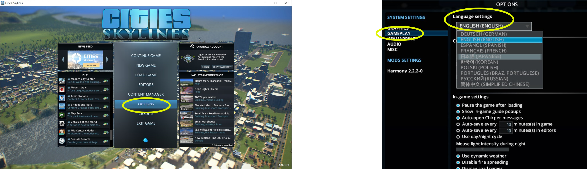

# Cities: Skylinesの起動と起動後の準備作業

------

## 1. Cities: Skylinesの起動と設定

### 1.1 Paradoxランチャーの起動

Cities: Skylinesの起動のため、「Paradoxランチャー」を起動する。

【方法1　デスクトップショートカット、スタートメニューから起動】

- デスクトップのショートカット、または
- Windowsのスタートメニュー＞Steam＞Cities Skylinesを選択

【方法2　Steamアプリから起動】

① Steamアプリ＞ライブラリ画面左欄の「Cities: Skylines」をクリック。

② 「▶プレイ」ボタンをクリック。

 
 

### 1.2 Cities: Skylinesの起動

ParadoxランチャーからCities: Skylinesを起動する。

① ランチャー画面左欄で「Cities: Skylines」をクリック。

② ランチャー画面右上の言語選択で「日本語」を選択。（他言語が表示されている場合のみ）
「プレイ」ボタンをクリック。

 
 

### 1.3 UIの日本語化

メインメニューが日本語以外で表示されている場合は日本語表示への変更を行う。

① メインメニューで「OPTIONS」をクリックし、設定ウィンドウを表示する。

② ウィンドウ左側の「GAMEPLAY」を選択、「Language settings」欄で「日本語（JAPANESE）」を選択する。

※選択欄に「日本語（JAPANESE）」が表示されない場合は、MODの有効化後にCities: Skylinesを再起動し上記の操作を行う。

  

