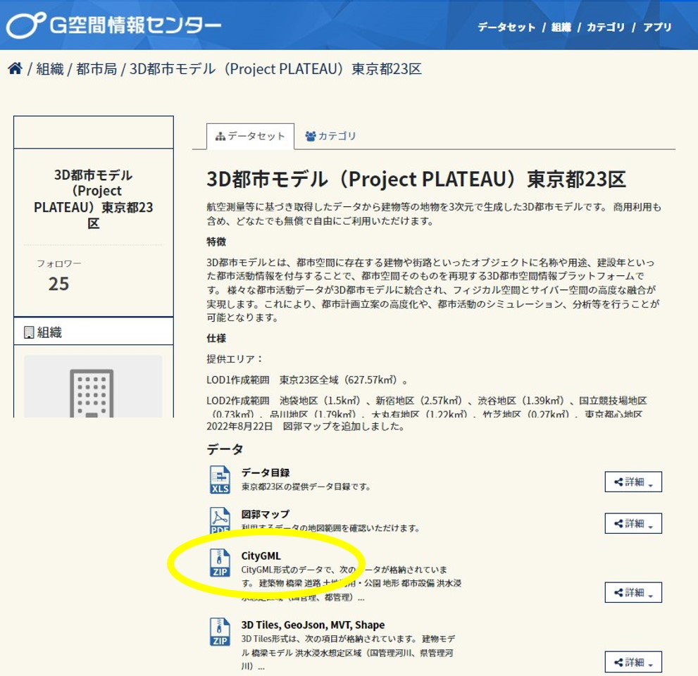
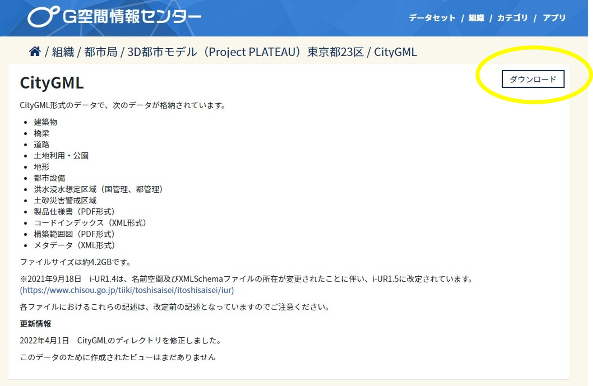

## 2. 3D都市モデルのダウンロード

------

ゲーム上に再現したい都市の3D都市モデルをダウンロード（※1）し、任意（デスクトップ等）の場所に保存してください。

① G空間情報センターの3D都市モデル（Project PLATEAU）ポータルサイト（ https://www.geospatial.jp/ckan/dataset/plateau ）をブラウザで開きます。

 
 
 

② リンクから任意の都市のデータセットページに進み、データ欄の「CityGML」をクリックします。

 
 
 

③ CityGMLのページで「ダウンロード」ボタンをクリックしてファイルをダウンロードし、Zipファイルを展開します（任意の場所に保存します）。

 
 
 

※1 サンプルデータ（茨城県鉾田市の3D都市モデルの一部データ）を使用する場合は
https://github.com/Project-PLATEAU/SkylinesPLATEAU/blob/main/SampleData/08234_hokota-shi_2020_citygml_4_op_sample_area.zip をダウンロードします。

 
 
