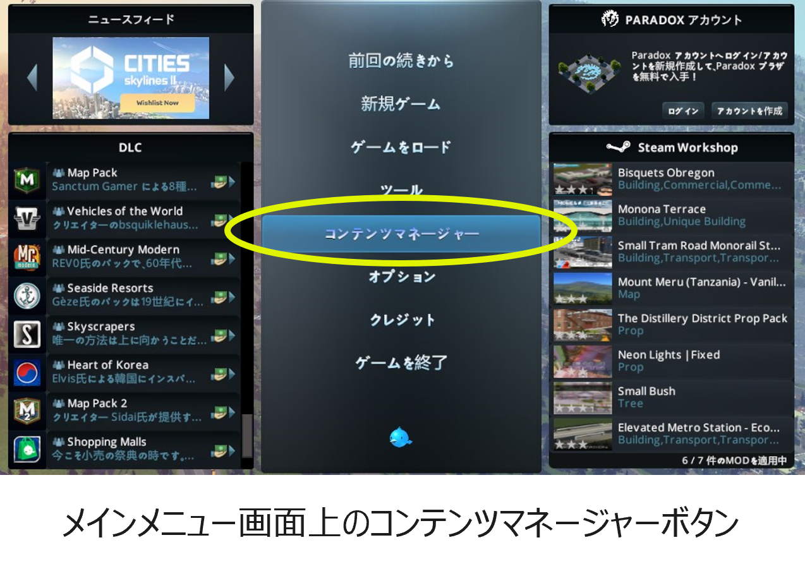
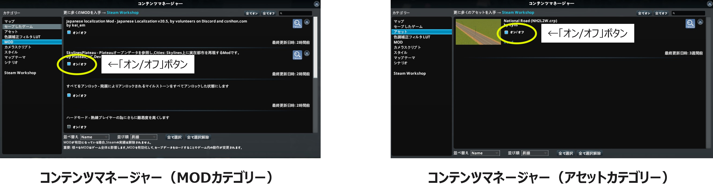

------

## 2. MOD、アセットの有効化

サブスクライブしたMOD、アセットと標準で用意されているMODを有効化する。

① メインメニューで「コンテンツマネージャー」を選択し、コンテマネージャーを起動する。

② コンテンツマネージャー画面左側の「カテゴリー」欄で「MOD」を選択する。

③ 「オン/オフ」ボタンをクリックしてハードモードを除く、全てのMODを有効化する。
 （オンの状態とする）

④ コンテンツマネージャー画面左側の「カテゴリー」欄で「アセット」を選択する。

⑤ 「National Road」を有効化する。

  
