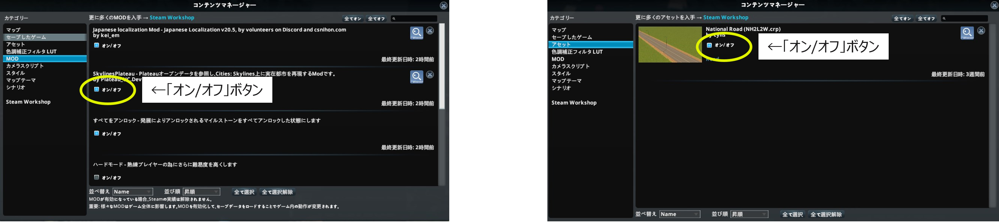

## 2. MOD、アセットの有効化

------

### 2.1 サブスクライブしたMOD、アセットと標準MODの有効化

① メインメニューで「コンテンツマネージャー」を選択し、コンテマネージャーを起動する。

 

  

② コンテンツマネージャー画面左側の「カテゴリー」欄で「MOD」を選択する。

③ 「オン/オフ」ボタンをクリックしてハードモードを除く、全てのMODを有効化する。
 （オンの状態とする）

 

  

④ コンテンツマネージャー画面左側の「カテゴリー」欄で「アセット」を選択する。

⑤ 「National Road」を有効化する。

 

### 2.2 参考資料（有効化するMOD、アセット一覧）

 
  
