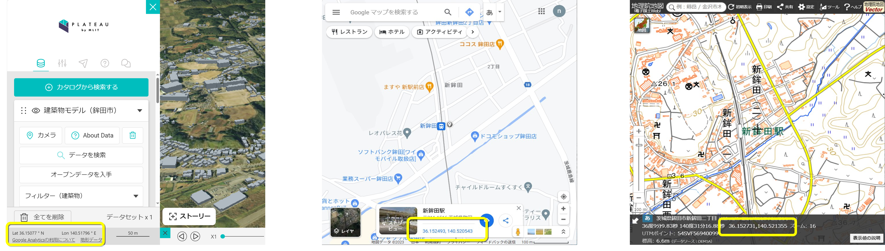
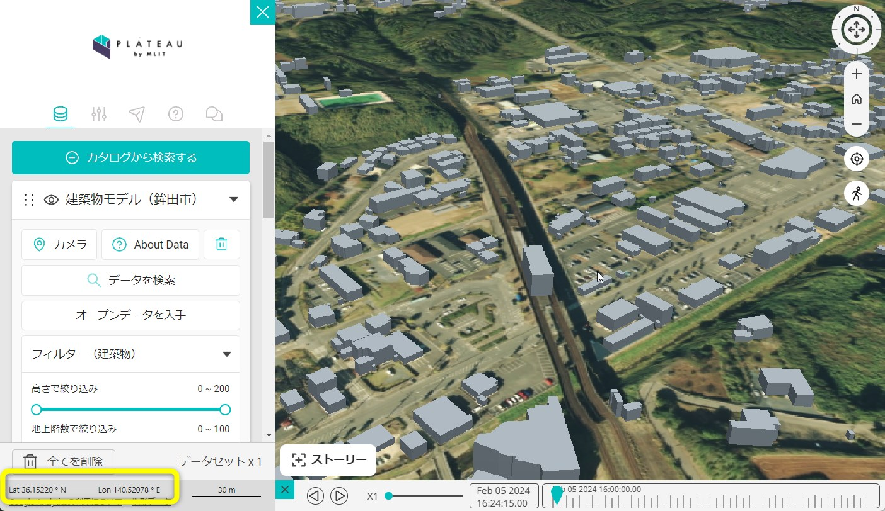
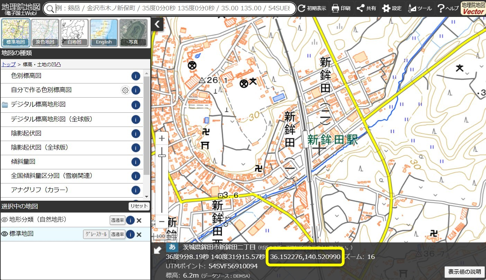

## 3. 中心座標の確認

------

3D都市モデルをインポートする際に必要な読込み位置の中心座標を確認し、値をコピーする。

① 3D都市モデルの読込みを行うエリアの中心座標をPLATEAU VIEW （※1）やGoogleマップ（※2）、地理院地図（※3）で確認、コピーする。

<!--

|  | 緯度経度の取得方法               |特徴                                 |
|----------------|-------------------------------|-----------------------------|
|<B>PLATEAU VIEW</B>      |マウスカーソルの位置の緯度経度を取得できる。 （固定されないので、確認時にマウスを動かさないように注意が必要）|3D都市モデルの有無、モデル化された建物の分布を確認しながら探索できる  |
|<B>Google map  </B>         	|クリックした位置の緯度経度を取得できる    	|住所、地名、施設名、カテゴリ等で検索可能  |
|<B>地理院地図       </B>         	|画面の中心点の緯度経度が取得できる         	|住所、地名、施設名等で検索可能|

 
  

 
 

※1 [PLATEAU VIEW 2.0 (mlit.go.jp)](https://plateauview.mlit.go.jp/)

※2 https://www.google.com/maps?authuser=0

※3 http://maps.gsi.go.jp/

 
 

-->

##### ※1 PLATEAU VIEW　(https://plateauview.mlit.go.jp/)

- 緯度経度の取得方法

    - マウスカーソルの位置の緯度経度を取得できる （固定されないので、確認時にマウスを動かさないように注意が必要）

- 特徴

    - 3D都市モデルの有無、モデル化された建物の分布を確認しながら探索できる

 
 

##### ※2 Google map　(https://www.google.com/maps?authuser=0)

- 緯度経度の取得方法

    - クリックした位置の緯度経度を取得できる

- 特徴

    - 住所、地名、施設名、カテゴリ等で検索可能

 

##### ※3 地理院地図　(http://maps.gsi.go.jp/)

- 緯度経度の取得方法

    - 画面の中心点の緯度経度が取得できる

- 特徴

    - 住所、地名、施設名等で検索可能  

