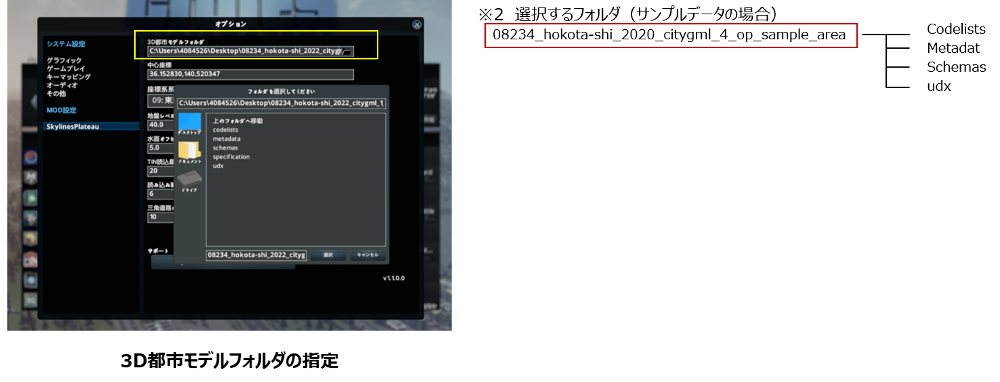
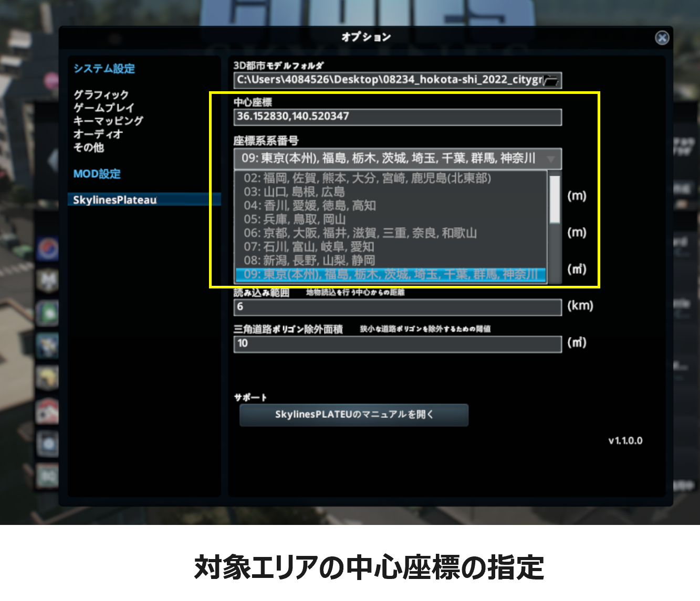
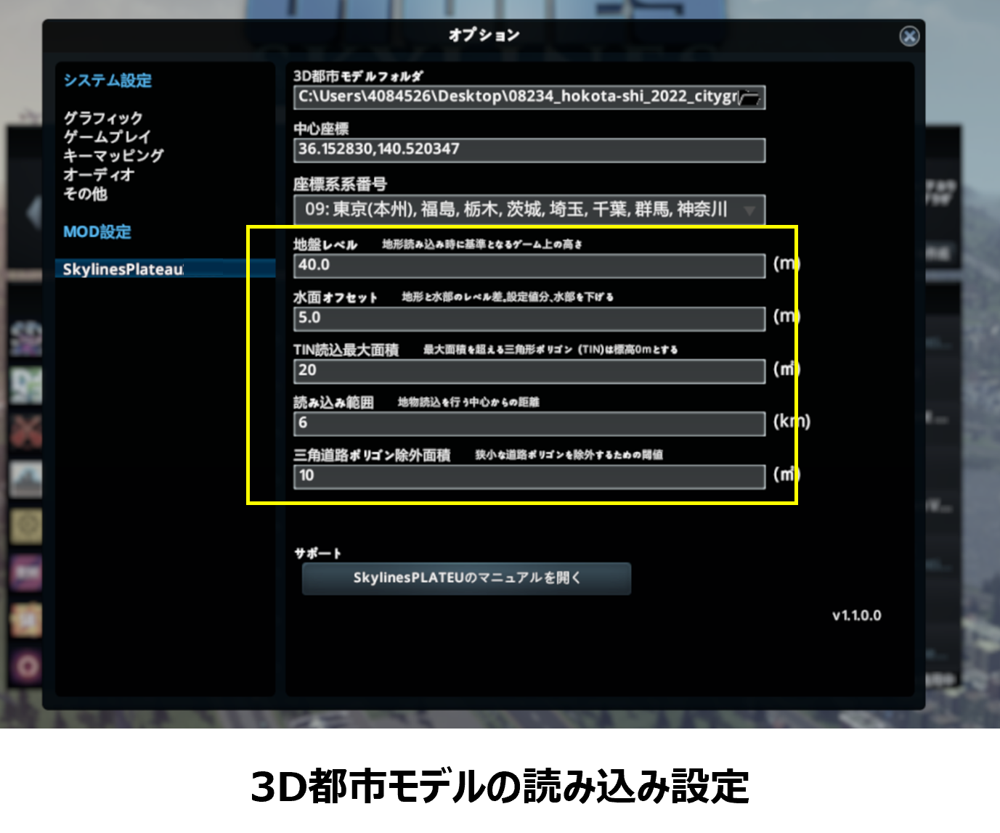
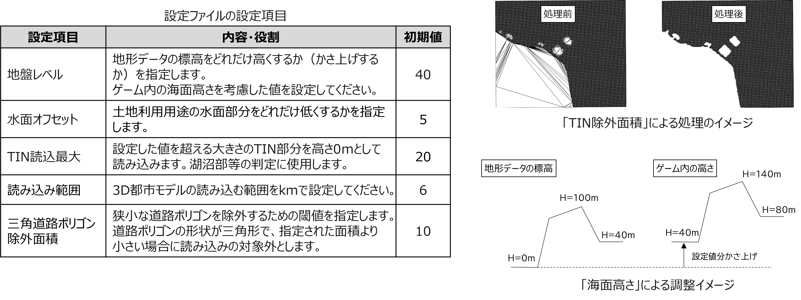

## 3. 3D都市モデル読み込み時の各種設定

------

### 3.1 設定ウィンドウの表示

①メインメニューで「オプション」をクリックし、設定ウィンドウを表示する。

②ウィンドウ左側の「SkylinesPlateau」を選択する。（各種設定方法は次ページ）

  

  
   
   

### 3.2 3D都市モデルフォルダの選択

①3D都市モデルフォルダ項目の右側にある、ファイルマークを選択する。

②「フォルダを選択してください」ウィンドウで、対象都市のCityGMLフォルダ（Zipファイルを展開済みのもの）を参照し、選択する（※2） 。

  

   
   

### 3.3 中心座標入力、座標系番号選択

対象エリアの中心座標（※3）を緯度経度カンマ区切り（小数点以下6桁）で入力、読み込みを行うエリアが属する都道府県から座標系系番号を選択する。

※3　[「1.4. 中心座標の確認」](userMan-1-3.md)の項を参照。　（サンプルデータを使用時は 36.152800,140.520300 を入力)

  

   
   

### 3.3 その他項目の入力

海面高さ等の変更を行う場合は各種設定項目に任意の数値を入力する。

  

    
