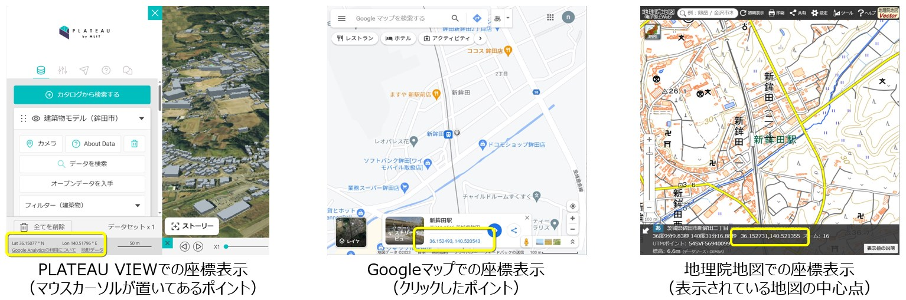

## 3. 中心座標の確認

------

3D都市モデルをインポートする際に必要な読込み位置の中心座標を確認し、値をコピーする。

① 3D都市モデルの読込みを行うエリアの中心座標をPLATEAU VIEW （※1）やGoogleマップ（※2）、地理院地図（※3）で

　確認、コピーする。

 

※1 [PLATEAU VIEW 2.0 (mlit.go.jp)](https://plateauview.mlit.go.jp/)

※2 https://www.google.com/maps?authuser=0

※3 http://maps.gsi.go.jp/

 
 

