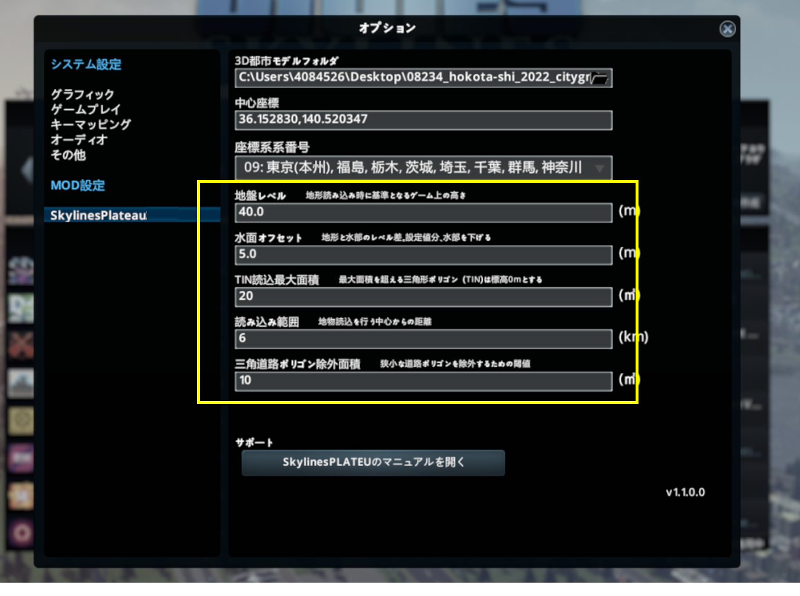

## 5. 3D都市モデル読込み時の各種設定

------

### 5.1 設定ウィンドウの表示

① メインメニューで「オプション」をクリックし、設定ウィンドウを表示します。

② ウィンドウ左側の「SkylinesPLATEAU」を選択します。

 

  

### 5.2 3D都市モデルフォルダの選択

① 3D都市モデルフォルダ項目の右側にある、ファイルマークを選択します。

② 「フォルダを選択してください」ウィンドウで、対象都市のCityGMLフォルダ（Zipファイルを展開済みのもの）を参照し、選択します（※1） 。

 

  

### 5.3 中心座標入力、座標系番号選択

対象エリアの中心座標（※2）をカンマ区切り（小数点以下6桁）で入力し、読込みを行うエリアが属する都道府県から座標系系番号を選択してください。

※2 [「3. 中心座標の確認」](userMan-2-3.md)の項を参照してください。（サンプルデータを使用時は36.152800,140.520300を入力）

 

  

### 5.4 その他項目の入力

海面高さ等の変更を行う場合は各種設定項目に任意の数値を入力してください。

 

  

|設定項目	|内容・役割	|初期値|
|----------------|-------------------------------|:-----------------------------:|
|地盤レベル	|地形データの標高をどれだけ高くするか（かさ上げするか）を指定します。 ゲーム内の海面高さを考慮した値を設定してください。|40|
|水面オフセット	|土地利用用途の水面部分をどれだけ低くするかを指定します。|	5|
|TIN読込最大	|設定した値を超える大きさのTIN部分を高さ0ｍとして読込みます。 湖沼部等の判定に使用します。	|20|
|読み込み範囲	|3D都市モデルを読込む範囲をkm単位で設定してください。|	6|
|三角道路ポリゴン除外面積	|狭小な道路ポリゴンを除外するための閾値を指定します。 道路ポリゴンの形状が三角形で、指定された面積より小さい場合に読込みの対象外とします。|10|

 

  
