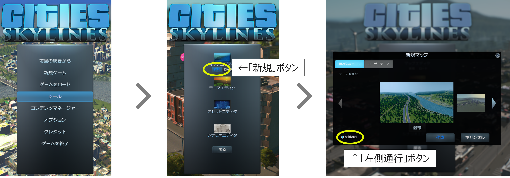
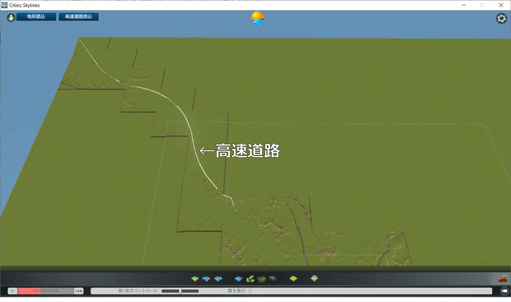
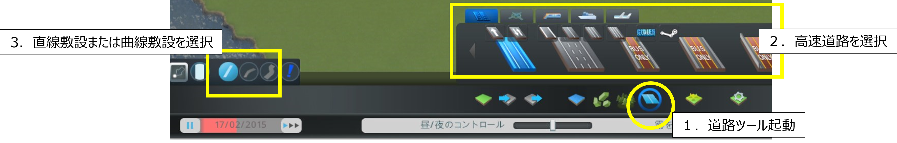

## 6. マップデータ作成

------

ゲーム開始時に必要となる、地形、高速道路、水源を設定したマップデータの作成を行う。（以下、座標値等はサンプルファイルを例としたもの）

### 6.1 新規マップ作成

- マップエディタで使用する新規マップの作成を行う。

  ①メインメニューで「ツール」をクリック。

  ②「ツール選択」でマップエディタ欄の「新規」ボタンをクリック。

  ③「新規マップ」ウィンドウのテーマを選択欄で「温帯」を選択し、「左側通行」ボタンをクリックしてオン（青色に点灯）の状態として「作成」ボタンをクリック。

 

  

### 6.2 地形・高速道路の読み込み

- マップエディタで使用する新規マップの作成を行う。

  SkylinesPLATEAUの「地形、高速道路読込」機能を使用して、地形と高速道路の読み込みを行う。

  ①マップエディタ上の「地形、高速道路読込」ボタンをクリックし、ダイアログを起動する。

  ②読み込みを行う地物（地形・高速道路）を選択する。オプション画面で入力した設定値を確認し、インポートボタンを選択する。

 

  

　注意点

　データがない部分は標高0ｍとなります。

　高速道路が存在しないエリアの場合は、「細部の調整」の項に従って、高速道路の敷設を行ってください。

 

  

### 6.3 海水面の設定

Cities: Skylinesの基本機能である「水」ツールを使用して、海水面の設定を行う。

① マップエディタ画面下部の「水」ツールボタンをクリックし、上部に表示される「海水面を変更」をクリック。

② 「海水面」設定ウィンドウで **「海水面高さ」に「0(ｍ)」を入力し、「再開」ボタンまたは「時間の速さ」ボタンをクリックして時間を進める。**

③ **その後すぐに、「海水面高さ」に「40(ｍ)」（※4）程度の数値を入力し、「水位を海水面に戻す」ボタンをクリック。**
 （この操作により、水位が安定するまでの時間を大幅に短縮することができます）

④水位が安定したら「水」ツールボタンをクリックして「水」ツールを終了し、「一時停止」ボタンをクリックして時間の進行を止める。

※4　Cities: Skylinesの水位のデフォルト値である40ｍに適合するようSkylinesPLATEAUでは地形読込の際に標高の補正を行っている。

 

  

### 6.4 細部の調整

マップデータをゲームで使用する場合は以下の必須事項が定められいる。

- 開始タイルに河川（水源）がある。
- 最低一つの地域内へ向かう高速道路がつながっている。
- 最低一つの地域外へ向かう高速道路がつながっている。

上記の必須事項をクリアするための操作を含めた細部の調整を行う。

　① 高速道路を敷設（3D都市モデルの範囲に高速道路が存在しない場合のみ）

　② 高速道路の地域外エリアとの接続

　③ 水際等の地形の調整

 

  

#### 6.4.1 高速道路の敷設・調整

①　高速道路を敷設（3D都市モデルの範囲に高速道路が存在しない場合のみ）

1. 「道路」ツールボタンをクリックしてツールを起動する。

2. 上部に表示されるウィンドウから任意の高速道路を選択する。

3. 「直線敷設」または「曲線敷設」を選択する。

 

  

4. 高速道路の始点となる位置をクリック。

5. 終点となる位置をクリック。

6. 4.と5.の操作を繰り返して必要な箇所に高速道路を敷設する。

 

  
②　高速道路の地域外エリアとの接続

1. 「道路」ツールボタンをクリックしてツールを起動する。

2. 上部に表示されるウィンドウから「ランプ」を選択する。

3. 「直線敷設」または「曲線敷設」を選択する。

4. 高速道路の終点をクリックしたのち、地域外の点をクリックして、地域外に向かう高速道路を敷設する。

5. 4.の手順と逆に地域外をクリックしたのち、高速道路の終点をクリックして、地域内に向かう高速道路を敷設する。

 

  

#### 6.4.2 地形の調整

①　水際等の地形の調整

1. 「地形」ツールボタンをクリックしてツールを起動する。
2. 上部に表示されるウィンドウから操作方法を選択する。
    （マウスカーソルを合わせることで詳しい操作方法、内容が表示される）

 

  

3. 画面左側のブラシ設定ウィンドウでブラシの硬さを設定する。値は「0.01」程度を目安に設定する。
4. 変更したい部分をクリックまたはドラッグして、地形の高さの調整を行う。

 

 
 

### 6.5 マップデータの保存

前項までの作業を行ったデータをマップデータとして保存し、ゲーム開始時に選択可能な状態とする。

　① 画面右上の「メニュー」ボタンをクリックして「ポーズ」ウィンドウを表示する。

　②「ポーズ」ウィンドウで「マップをセーブ」ボタンをクリック。

　③「マップをセーブ」ウィンドウでファイル名、マップ名を入力し、「新規ゲームパネルへマップを追加」を有効化後、

　　「セーブ」ボタンをクリック。 （ファイル名とマップ名は同一とすることを推奨）

　④「ポーズ」ウィンドウで「終了」をクリックし、「ゲームを終了」ウィンドウで「メインメニューへ」をクリック。

 

  
