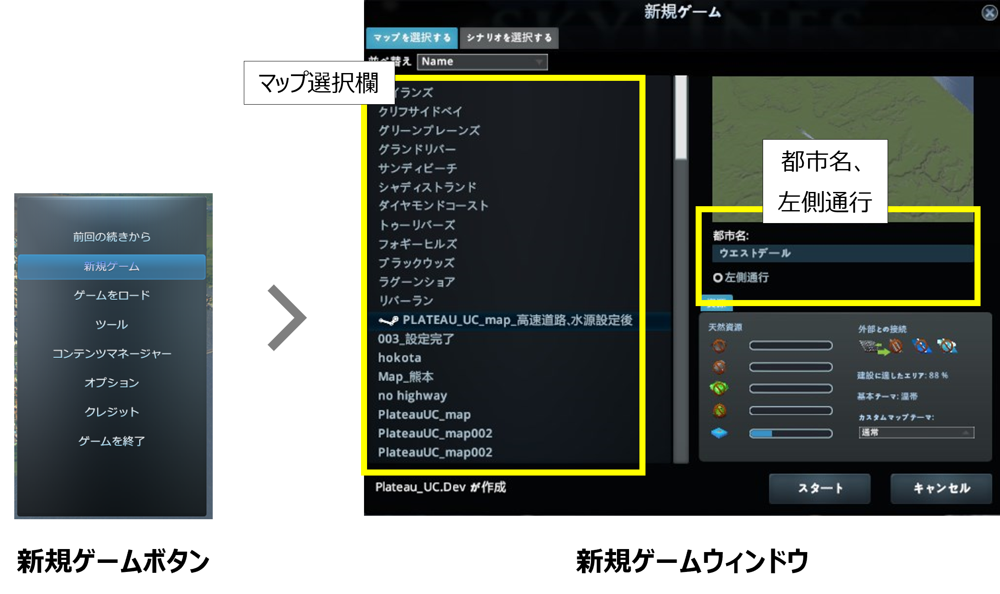
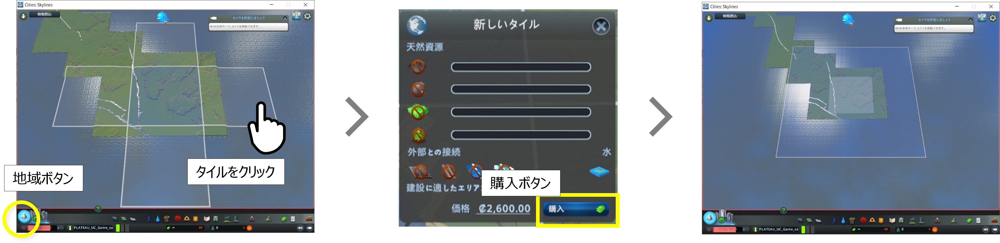
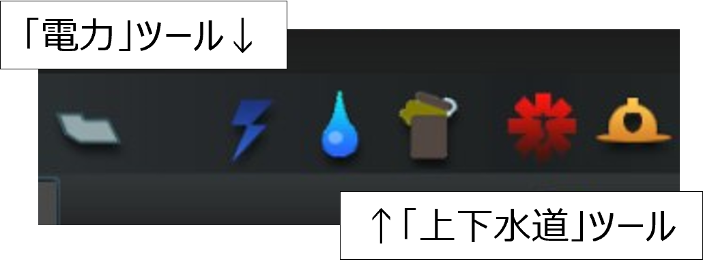
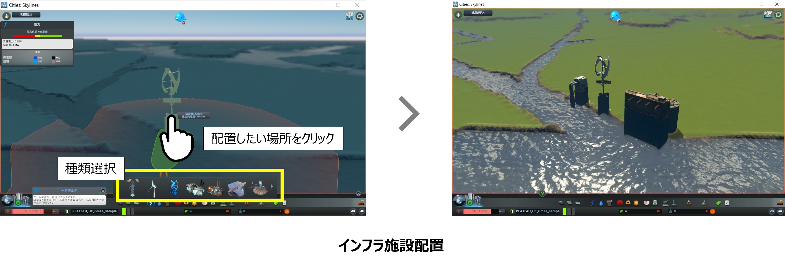
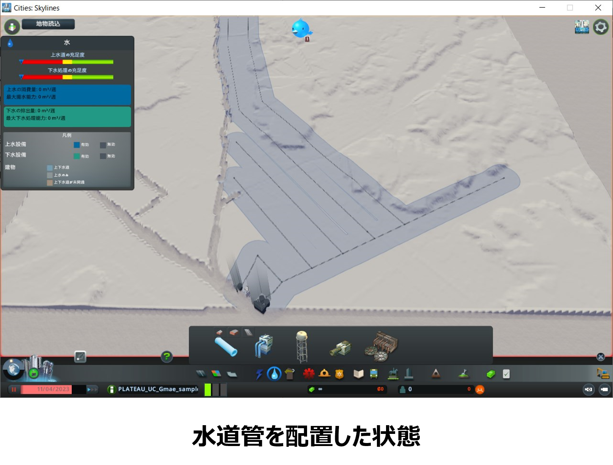

## 7. 新規ゲームの開始、インフラ施設配置

------

### 7.1 新規マップ作成

　① メインメニューで「新規ゲーム」ボタンをクリックし、「新規ゲーム」ウィンドウを表示する。

　② ウィンドウ左側のマップ選択欄から作成したマップデータを選択する。

　③ ウィンドウ右上の「都市名」を入力し、「左側通行」を有効化後に「スタート」ボタンをクリック。（都市名は任意）

　※　「スタート」ボタンクリック後に表示される説明等のウィンドウは「ｘ」ボタン等で閉じる。

 

  

### 7.2 タイルの購入

新規ゲーム開始時は開始タイル（約2kmｘ約2kmの1タイル分）のみが編集可能な状態となっている。

広範囲の編集を行えるようするため、開始タイル周辺のタイルを購入する。

　① 画面左下の「地域」ボタンをクリックし、タイルを選択可能な状態にする。

　② 開始タイルに隣接するタイルをクリックし、「新しいタイル」ウィンドウを表示する。

　③「購入」ボタンをクリックして購入を完了（所有）する。

　④ ②、③の操作を繰り返し、9タイル（縦3タイルｘ横3タイル）を所有した状態にしたら、再び「地域」

　　ボタンをクリックして、購入操作を終了する。

 

  

### 7.3 インフラ施設配置

都市が発展するために必要なインフラ施設（発電所、上下水道施設）の配置を行う。

3D都市モデルを読み込んだ範囲内にインフラ施設がない場合は、購入したタイルの端部等に配置を行う。

 

  

　① 画面下部のツールボタンの「電力」をクリックし、上部に表示されるウィンドウで発電所の種類を選択する。

　② 配置したい箇所をクリック。

　③ 配置が完了したら「電力」ツールボタンをクリック。

　④ 同様の操作で「上下水道」ツールの「ポンプ場」、「下水処理施設」、「水道管」を配置する。

 

  

注意点

- 施設の種類によっては配置できる場所が決められているものがあります。（ポンプ場は河川沿いのみ配置可能など）
- 電線や水道管の配置を行わないと電力や上下水道のサービスが提供されず、都市が発展しません。
- 都市が発展すると電力、上下水道施設以外の公共的な施設の配置が必要になります。電力、上下水道施設と同様の手順で施設の配置を行ってください。

 

  
