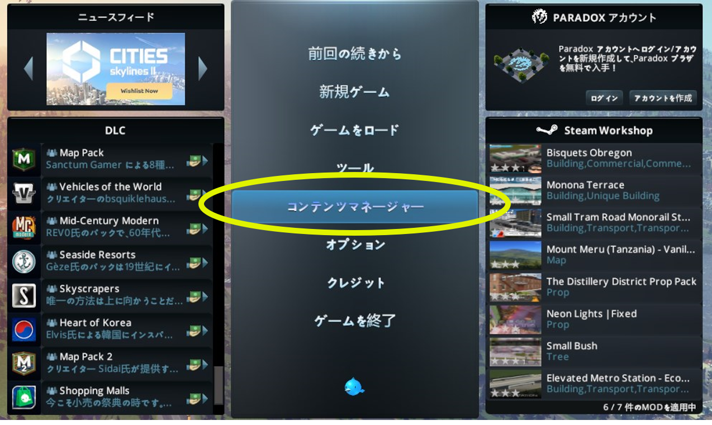

# Cities: Skylinesの起動と起動後の準備作業

------

## 1. Cities: Skylinesの起動と設定

### 1.1 Paradoxランチャーの起動

Cities: Skylinesの起動のため、「Paradoxランチャー」を起動する。

【方法1　デスクトップショートカット、スタートメニューから起動】

- デスクトップのショートカット、または
- Windowsのスタートメニュー＞Steam＞Cities Skylinesを選択

【方法2　Steamアプリから起動】

① Steamアプリ＞ライブラリ画面左欄の「Cities: Skylines」をクリック。

② 「▶プレイ」ボタンをクリック。

 
 

### 1.2 Cities: Skylinesの起動

ParadoxランチャーからCities: Skylinesを起動する。

① ランチャー画面左欄で「Cities: Skylines」をクリック。

② ランチャー画面右上の言語選択で「日本語」を選択。（他言語が表示されている場合のみ）
「プレイ」ボタンをクリック。

 
 

### 1.3 UIの日本語化

メインメニューが日本語以外で表示されている場合は日本語表示への変更を行う。

① メインメニューで「OPTIONS」をクリックし、設定ウィンドウを表示する。

② ウィンドウ左側の「GAMEPLAY」を選択、「Language settings」欄で「日本語（JAPANESE）」を選択する。

※選択欄に「日本語（JAPANESE）」が表示されない場合は、MODの有効化後にCities: Skylinesを再起動し上記の操作を行う。

 
 

------

## 2. MOD、アセットの有効化

サブスクライブしたMOD、アセットと標準で用意されているMODを有効化する。

① メインメニューで「コンテンツマネージャー」を選択し、コンテマネージャーを起動する。

② コンテンツマネージャー画面左側の「カテゴリー」欄で「MOD」を選択する。

③ 「オン/オフ」ボタンをクリックしてハードモードを除く、全てのMODを有効化する。
 （オンの状態とする）

④ コンテンツマネージャー画面左側の「カテゴリー」欄で「アセット」を選択する。

⑤ 「National Road」を有効化する。

 
 

------

## 3. 3D都市モデル読込の各種設定

3D都市モデルの読み込みに必要な各種設定を行う。

①メインメニューで「オプション」をクリックし、設定ウィンドウを表示する。

②ウィンドウ左側の「SkylinesPlateau」を選択する。（各種設定方法は次ページ）

■3D都市モデルフォルダを指定する

①3D都市モデルフォルダ項目の右側にある、ファイルマークを選択する。

②「フォルダを選択してください」ウィンドウで、対象都市のCityGMLフォルダ（Zipファイルを展開済みのもの）を参照し、選択する（※2） 。

■中心座標を指定する

③対象エリアの中心座標（※3）を緯度経度カンマ区切り（小数点以下6桁）で入力、読み込みを行うエリアが属する都道府県から座標系系番号を選択する。

※3　「Ⅰ章-4. 中心座標の確認」の項を参照。　（サンプルデータ： 36.152800,140.520300 ）

■その他、値の変更の必要がある場合は数値を入力する。

 
 

------

## （参考）3D都市モデル読込の各種設定

 
 

------

## （参考） MOD、アセットの有効化

 
 

