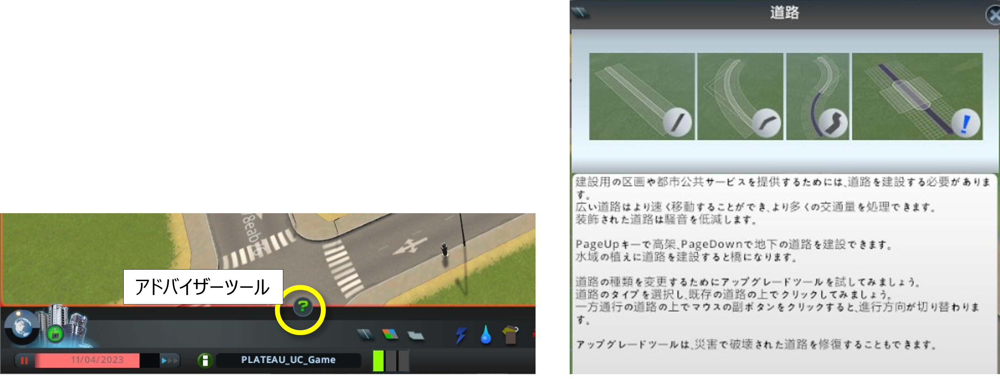
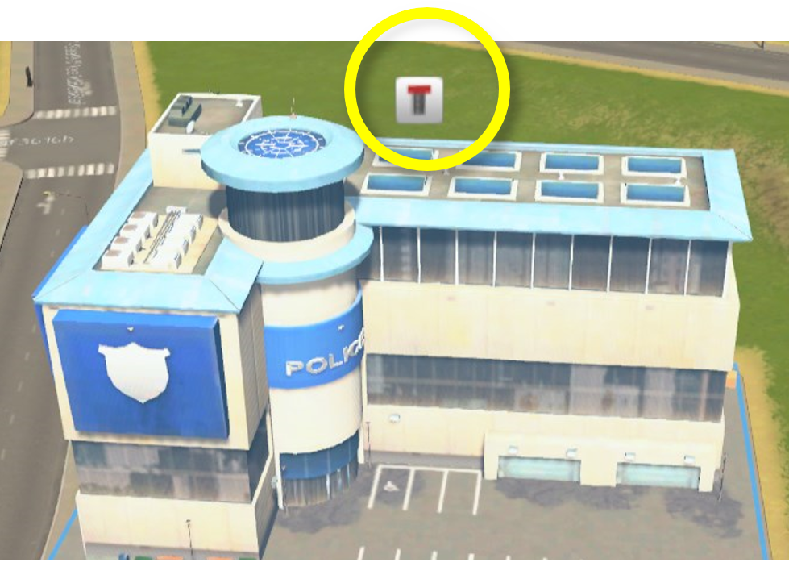
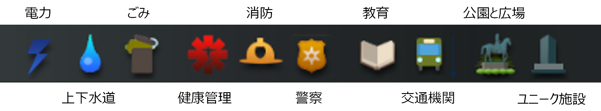
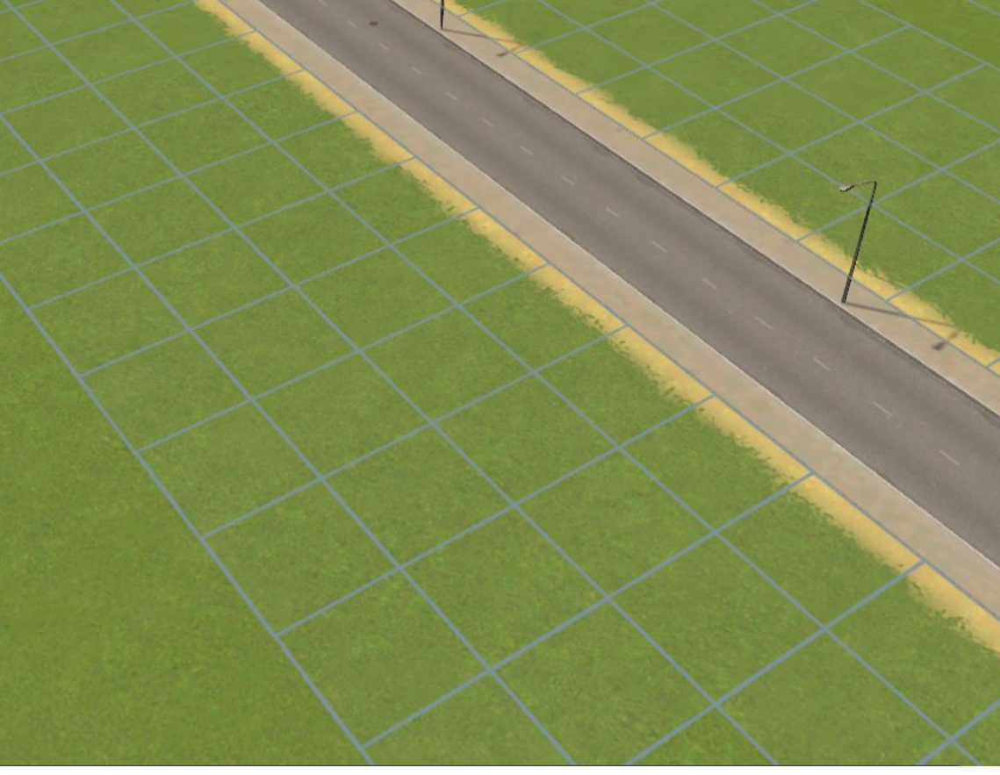

## 4. 細部調整

------

3D都市モデルの読み込み後、再現が十分でない箇所の修正を行う。

※Cities: Skylinesに標準で準備されている編集ツールの詳しい操作方法はツールを選択後、「アドバイザー」ツールをクリックして表示される内容を参照してください。

 

 

作業内容

4.1　道路の敷設（高速道路と道路の接続）

4.2　複雑な道路形状の修正（ロータリー部等）

4.3　道路の幅員や種類の変更

4.4　主要建物の位置調整

4.5　自動配置されない主要建物（ごみ処理、火葬場等）の配置

4.6　区画の設定

  

### 4.1 道路の敷設（高速道路と道路の接続）

　① 「道路」ツールボタンをクリックしてツールを起動する。

　② 上部に表示されるウィンドウから任意の道路の種類を選択する。

　③ 以降、高速道路の敷設方法と同様の手順で道路の敷設を行い、高速道路と接続する。

 

  

### 4.2 複雑な道路形状の修正（ロータリー部等）

　① 「ブルドーザー」ツールを選択し、形状の変更を行いたい箇所の道路をクリックして削除する。

　② 前項と同様の手順で「道路」ツールを使用して敷設したい道路の種類を選択し、画面上をクリックして道路を敷設する。

 

  

### 4.3 道路の幅員や種類の変更

　① 「道路」ツールを選択し、変更後の道路の種類を選択する。

　② 画面下部に表示される「道路をアップグレード」ボタンをクリック。

　③ 変更したい箇所の道路をクリック。

※道路形状が複雑な場合、「道路をアップグレード」が意図通りに動作しない場合があります。

　前項の手順で一旦、道路を削除後、敷設の操作を行ってください。

 

  

### 4.4 主要建物の位置調整

未接道の警告が表示されている建物の位置調整を行う。

 

 

　① ツールを選択していない状態で建物をクリック。

　② 施設の情報表示ウィンドウで「施設の移転」ボタンをクリック。

　③ 画面上でマウスを操作して移転後の位置でクリック。

 

  

### 4.5 自動配置されない主要建物（ごみ処理、火葬場等）の配置

　① 画面下部のツール群から配置したい建物が属するツールを選択する。

　② ツール選択後に表示されるウィンドウで建物を選択する。

　③ 画面上の配置したい位置をクリック。

 

 

  

### 4.6 区画の設定

Cities: Skylinesでは道路を敷設すると道路沿いにセルが自動配置される。

 

  

セルに建設される建物の種類は区画より決定されるため、「区画」ツールを使用して区画の設定を行う。

　① 画面下部のツール群から配置したい建物が属するツールを選択する。

　② 上部に表示される「区画の種類」ウィンドウから任意の区画を選択する。

　③ 「ツール設定」でブラシの種類を選択する。

 

 　④ 設定したいセル上をクリック、またはドラッグ。

　※　区画の種類を変更する際は、「区画解除」を使用して設定を解除してから新たな区画を設定する。

 

  
